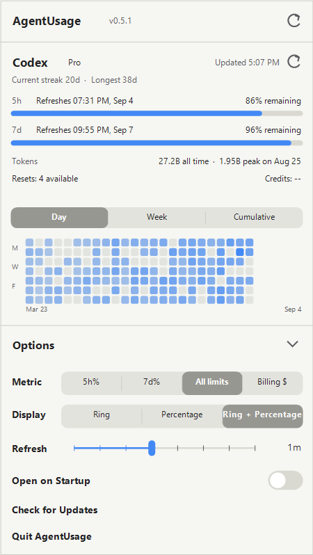

# AgentUsage for Windows

AgentUsage is a native Windows taskbar tray app for monitoring Codex usage. 



## Download

Download the latest package from [GitHub Releases](https://github.com/Liuike/AgentUsage/releases/latest), extract it, and run `Install-AgentUsage.ps1` from PowerShell. The installer places the app in `%LOCALAPPDATA%\Programs\AgentUsage`, creates a Start Menu shortcut, and launches the tray app.

You can also run `AgentUsage.exe` directly from the extracted folder for portable use.

## Requirements

- Windows 10 or Windows 11
- .NET Framework 4.7.2 or newer
- Codex CLI or Codex Desktop installed and signed in

AgentUsage finds Codex through `PATH`, Codex Desktop's versioned installation directory, npm/NVM locations, Windows App Paths, and other common local installations. Set `AGENTUSAGE_CODEX_PATH` to the full path of `codex.exe` or `codex.cmd` for a custom installation.

## Features

- Five-hour and seven-day Codex usage limits
- Account plan, credits, earned resets, and reset times
- Day, week, and cumulative activity charts
- Ring, percentage, and combined tray display modes
- Configurable refresh intervals and Windows startup integration
- Windows light and dark theme support
- In-app checks for new Windows releases
- No analytics or telemetry

## Build from source

From PowerShell at the repository root:

```powershell
.\Scripts\build-windows.ps1
.\Windows\bin\AgentUsage.exe --show
```

Create a distributable ZIP and checksum with:

```powershell
.\Scripts\package-windows.ps1
```

## Repository branches

- `master` is the default Windows branch and the source for Windows CI/CD and releases.
- `macos` preserves the original macOS application and its history. macOS builds are not published by the default branch pipeline.

## Attribution

This Windows edition is based on [Rock-Z/AgentUsage](https://github.com/Rock-Z/AgentUsage). The original project established the product concept, design language, macOS implementation, and initial Codex usage integration.

Licensed under the [MIT License](LICENSE).
